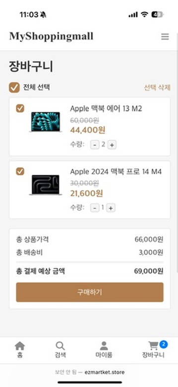
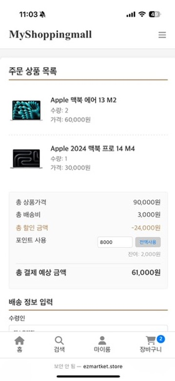
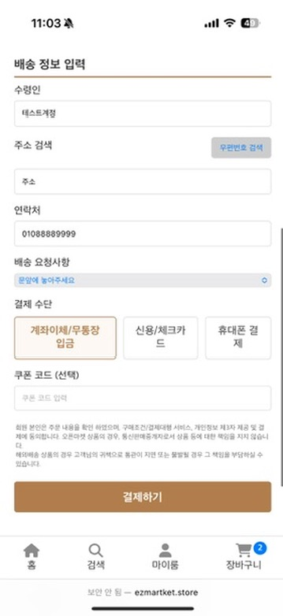
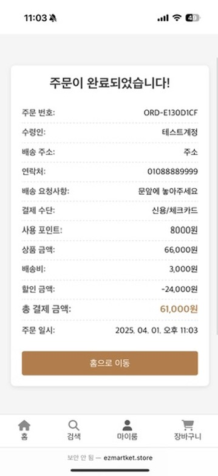
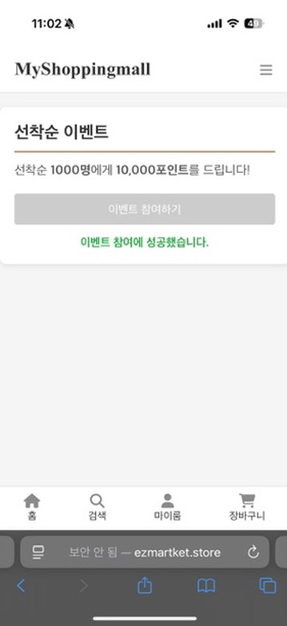

# Shopping Vue

### 기간: 2025-03-01 ~ 2025-03-30

## 애플리케이션 이미지

    

        <h4>메인 페이지</h4>
        
    

    

        <h4>상품 상세</h4>
        
    

    

        <h4>장바구니</h4>
        
    

    

        <h4>상품 구매 1</h4>
        
    

    

        <h4>상품 구매 2</h4>
        
    

    

        <h4>상품 주문 완료</h4>
        
    

    

        <h4>이벤트 참여</h4>
        
    

    

        <h4>이벤트 참여 실패(이미 참여)</h4>
        
    

    

        <h4>주문 리스트</h4>
        
    

    

        <h4>리뷰 작성</h4>
        
    

    

        <h4>리뷰 확인</h4>
        
    

